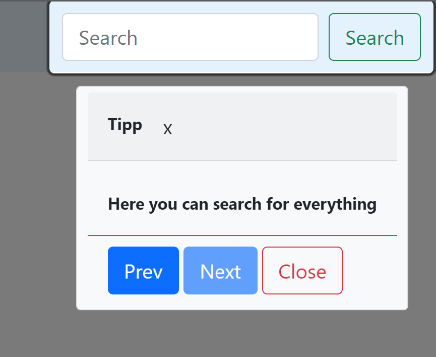

# xpln.js

xpln.js stands for explain and is a simple introduction/tutorial library for your page.
It uses popper.js, so if you already use it, don't add it again.



## CSS
Add this `<link rel="stylesheet" href="src/xpln.css">` into your `<head>`.

## Scripts
Import xpln.js in your script file like 
```js
import xpln from './src/xpln.min.js';
```

## Use it
In your HTML:
- add attribute and text `data-xpln="This is your explanation text."`
- optional: add step attribute to each element `data-xpln-step="0"`

In your script:
- Use options or not.
- Call init
- Call show

```js
const options = { delay: 200, disableActiveElem: false };
xpln.init(options);
xpln.show();

document.querySelector('.show-help').addEventListener('click', () => {
    xpln.show();
});
```

## Example
See index.html for an "complete" example.